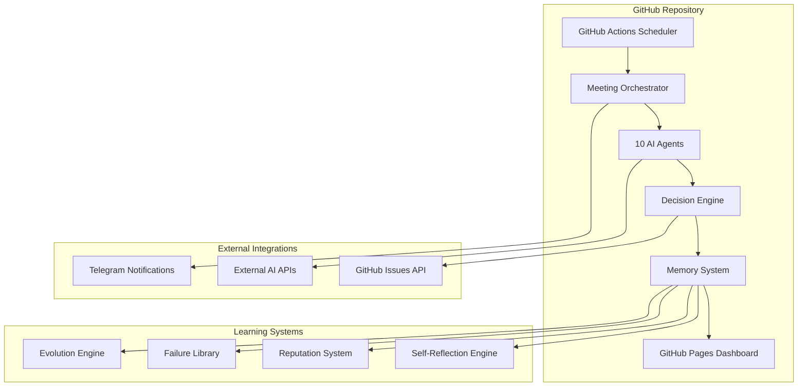

# وثيقة التصميم - نظام الشركة البرمجية الذاتية (AACS)

## نظرة عامة

نظام الشركة البرمجية الذاتية (AACS) هو منصة متطورة تحاكي عمل شركة برمجيات حقيقية باستخدام 10 وكلاء ذكيين مستقلين. يعمل النظام على GitHub Actions مع دورات تلقائية كل 6 ساعات، ويتضمن أنظمة تعلم ذاتي وتطور مستمر لضمان التحسن التدريجي في الأداء.

## Repository Structure (V0 Contract)

```
/
├── agents/          # تعريف الوكلاء والمنطق الداخلي
├── core/            # orchestrator, decision engine, memory
├── scripts/         # أدوات التشغيل المحلية والاختبار
├── .github/workflows/ # GitHub Actions
├── meetings/        # مخرجات الاجتماعات
├── board/           # لوحة المهام
├── tests/
│   ├── property/    # اختبارات الخصائص
│   └── integration/ # اختبارات التكامل
├── docs/            # الوثائق والتكوين
└── dashboard/       # لوحة التحكم
```

**ملاحظة مهمة**: يجب على أي كود يتم توليده الالتزام بهذا الهيكل بدقة. لا يُسمح بإنشاء مجلدات أو ملفات خارج هذا التنظيم في V0.

## Runtime Contract (V0)

- **Python**: 3.11 (main orchestrator, agents, memory)
- **Node.js**: 20 (dashboard only)
- **OS**: ubuntu-latest (GitHub Actions)
- **Containerization**: Not allowed in V0
- **Package managers**: pip / npm only

**Any generated code must respect this runtime.**

## البنية المعمارية

### البنية العامة



### طبقات النظام

1. **طبقة التشغيل (Execution Layer)**
   - GitHub Actions كمحرك التشغيل الأساسي
   - دورات تلقائية كل 6 ساعات + تشغيل يدوي
   - إدارة الموارد والذاكرة

2. **طبقة الوكلاء (Agents Layer)**
   - 10 وكلاء متخصصين مع أدوار محددة
   - نظام تواصل داخلي منظم
   - آليات التصويت والإجماع

3. **طبقة الذكاء (Intelligence Layer)**
   - نظام الذاكرة الدائم
   - محرك اتخاذ القرارات
   - أنظمة التعلم والتطور

4. **طبقة التفاعل (Interface Layer)**
   - لوحة تحكم GitHub Pages
   - إشعارات Telegram
   - تكامل مع GitHub Issues

## المكونات والواجهات

### 1. وحدة إدارة الوكلاء (Agent Management)

```python
class AgentManager:
    def __init__(self):
        self.agents = {
            'ceo': CEOAgent(),
            'pm': PMAgent(),
            'cto': CTOAgent(),
            'developer': DeveloperAgent(),
            'qa': QAAgent(),
            'marketing': MarketingAgent(),
            'finance': FinanceAgent(),
            'critic': CriticAgent(),
            'chair': ChairAgent(),
            'memory': MemoryAgent()
        }
        self.reputation_system = ReputationSystem()
    
    def conduct_meeting(self, agenda: str) -> MeetingResult:
        # تنفيذ منطق الاجتماع
        pass
    
    def update_agent_reputation(self, agent_id: str, performance_data: dict):
        # تحديث سمعة الوكيل
        pass
```

### 2. نظام الذاكرة الدائم (Persistent Memory)

```python
class MemorySystem:
    def __init__(self, storage_path: str):
        self.storage_path = storage_path
        self.session_history = []
        self.failure_library = FailureLibrary()
        self.knowledge_base = KnowledgeBase()
    
    def store_meeting_data(self, meeting_data: MeetingData):
        # حفظ بيانات الاجتماع
        pass
    
    def retrieve_context(self, query: str) -> List[ContextItem]:
        # استرجاع السياق التاريخي
        pass
    
    def learn_from_failure(self, failure_data: FailureData):
        # التعلم من الإخفاقات
        pass
```

### 3. محرك التصويت والقرارات (Voting & Decision Engine)

```python
class VotingSystem:
    def __init__(self, reputation_system: ReputationSystem):
        self.reputation_system = reputation_system
        self.voting_history = []
    
    def initiate_vote(self, proposal: Proposal) -> VoteResult:
        # بدء عملية التصويت
        weighted_votes = self._calculate_weighted_votes(proposal)
        return self._determine_outcome(weighted_votes)
    
    def _calculate_weighted_votes(self, proposal: Proposal) -> dict:
        # حساب الأصوات المرجحة حسب السمعة والخبرة
        pass
```

### 4. محلل العائد على الاستثمار (ROI Analyzer)

```python
class ROIAnalyzer:
    def __init__(self):
        self.market_data = MarketDataProvider()
        self.cost_estimator = CostEstimator()
    
    def analyze_project(self, project_spec: ProjectSpec) -> ROIAnalysis:
        # تحليل العائد المتوقع
        development_cost = self.cost_estimator.estimate_development(project_spec)
        market_potential = self.market_data.analyze_opportunity(project_spec)
        
        return ROIAnalysis(
            estimated_cost=development_cost,
            projected_revenue=market_potential.revenue,
            roi_percentage=self._calculate_roi(development_cost, market_potential),
            risk_factors=market_potential.risks
        )
```

## نماذج البيانات

### عقد المخرجات الإلزامية (Artifacts Contract)

كل اجتماع يجب أن ينتج الملفات التالية بشكل إلزامي:

```
meetings/<session_id>/transcript.jsonl     # سجل المحادثة الكامل
meetings/<session_id>/minutes.md          # محضر الاجتماع بالعربية
meetings/<session_id>/decisions.json      # القرارات والتصويت والROI
meetings/<session_id>/self_reflections/<agent>.md  # تقييمات ذاتية لكل وكيل
meetings/index.json                       # فهرس جميع الاجتماعات
board/tasks.json                          # لوحة مهام Jira-style (ToDo/InProgress/Done) + owners + links
```

### مخطط decisions.json (V0)

```json
{
  "decisions": [
    {
      "id": "string",
      "title": "string", 
      "description": "string",
      "votes": {
        "agent_id": "vote_value"
      },
      "outcome": "approved|rejected|deferred",
      "roi": {
        "estimated_cost": "number",
        "projected_revenue": "number", 
        "roi_percentage": "number",
        "assumptions": ["string"]
      },
      "action_items": ["string"]
    }
  ]
}
```

### 1. نموذج الاجتماع (Meeting Model)

```python
@dataclass
class MeetingData:
    session_id: str
    timestamp: datetime
    agenda: str
    participants: List[str]
    transcript: str
    decisions: List[Decision]
    action_items: List[ActionItem]
    self_reflections: Dict[str, SelfReflection]
    
@dataclass
class Decision:
    id: str
    title: str
    description: str
    votes: Dict[str, Vote]
    outcome: str
    roi_analysis: ROIAnalysis
    assigned_tasks: List[Task]
```

### 2. نموذج الوكيل (Agent Model)

```python
@dataclass
class Agent:
    id: str
    name: str
    role: str
    expertise_areas: List[str]
    reputation_score: float
    voting_weight: float
    performance_history: List[PerformanceRecord]
    
@dataclass
class PerformanceRecord:
    date: datetime
    task_id: str
    accuracy_score: float
    speed_score: float
    impact_score: float
    self_assessment: str
```

### 3. نموذج المشروع (Project Model)

```python
@dataclass
class Project:
    id: str
    name: str
    description: str
    status: ProjectStatus
    roi_analysis: ROIAnalysis
    tasks: List[Task]
    timeline: ProjectTimeline
    generated_code: Optional[CodeArtifacts]
    
@dataclass
class CodeArtifacts:
    repository_url: str
    main_files: List[str]
    documentation: str
    tests: List[str]
    deployment_config: dict
```

## خصائص الصحة (Correctness Properties)

*الخصائص هي خصائص أو سلوكيات يجب أن تبقى صحيحة عبر جميع عمليات تشغيل النظام - في الأساس، بيانات رسمية حول ما يجب أن يفعله النظام. تعمل الخصائص كجسر بين المواصفات المقروءة بشريًا وضمانات الصحة القابلة للتحقق آليًا.*

### الخصائص الأساسية للنظام

**الخاصية 1: تكوين الوكلاء الصحيح**
*لأي* تهيئة للنظام، يجب أن يتم إنشاء بالضبط 10 وكلاء بأدوار فريدة ومحددة مسبقاً
**تتحقق من: المتطلبات 1.1, 1.2**

**الخاصية 2: استمرارية الذاكرة**
*لأي* بيانات يتم حفظها في النظام، يجب أن تكون قابلة للاسترجاع بعد إعادة تشغيل النظام مع جميع البيانات الوصفية
**تتحقق من: المتطلبات 2.1, 2.2, 2.4**

**الخاصية 3: دورية الاجتماعات**
*لأي* فترة زمنية مدتها 6 ساعات، يجب أن يتم جدولة اجتماع تلقائي واحد على الأقل (Meetings scheduled in UTC cron; stored timestamps are ISO8601 with timezone; allowed scheduling jitter ±15 minutes)
**تتحقق من: المتطلبات 3.1**

**الخاصية 4: حفظ قرارات الاجتماعات**
*لأي* اجتماع يتم إنهاؤه، يجب أن يتم حفظ جميع المناقشات والقرارات وعناصر العمل في الذاكرة الدائمة
**تتحقق من: المتطلبات 3.4, 3.5**

### خصائص نظام التصويت والقرارات

**الخاصية 5: ترجيح الأصوات**
*لأي* عملية تصويت، يجب أن تكون أوزان الأصوات متناسبة مع درجات السمعة والخبرة للوكلاء
**تتحقق من: المتطلبات 4.2, 13.3**

**الخاصية 6: حد المشاركة الأدنى**
*لأي* قرار يتطلب إجماع، يجب أن تفشل عملية التصويت إذا لم تحقق الحد الأدنى للمشاركة
**تتحقق من: المتطلبات 4.4**

**الخاصية 7: تقييم الناقد المسبق**
*لأي* اقتراح يتم طرحه للتصويت، يجب أن يتم تقييمه من قبل الوكيل الناقد قبل بدء التصويت
**تتحقق من: المتطلبات 4.5**

### خصائص التحليل المالي

**الخاصية 8: تحليل العائد الشامل**
*لأي* مشروع مقترح، يجب أن يحصل على تحليل ROI يتضمن التكلفة والإيرادات المتوقعة وعوامل المخاطر
**تتحقق من: المتطلبات 5.1, 5.6**

**الخاصية 9: مقارنة الأداء الفعلي**
*لأي* مشروع مكتمل، يجب أن يتم مقارنة النتائج الفعلية مع التوقعات الأولية في جميع المقاييس
**تتحقق من: المتطلبات 5.3, 12.3, 12.4**

### خصائص البناء التلقائي

**الخاصية 10: توليد الكود التلقائي**
*لأي* مشروع معتمد، يجب أن يتم توليد تنفيذ كود كامل يتبع معايير الجودة المحددة
**تتحقق من: المتطلبات 6.1, 6.4**

**الخاصية 11: الاختبار التلقائي**
*لأي* كود يتم توليده، يجب أن يتم اختباره والتحقق منه تلقائياً من قبل وكيل ضمان الجودة
**تتحقق من: المتطلبات 6.3**

### خصائص إدارة المهام

**الخاصية 12: تتبع المهام الشامل**
*لأي* مهمة يتم إنشاؤها، يجب أن تحصل على أولوية ومهلة زمنية وتتبع للتقدم
**تتحقق من: المتطلبات 7.1, 7.2, 7.3**

**الخاصية 13: إنفاذ التبعيات**
*لأي* مهمة لها تبعيات، يجب أن يتم تنفيذها بالتسلسل الصحيح فقط
**تتحقق من: المتطلبات 7.4**

### خصائص التعلم الذاتي

**الخاصية 14: المراجعة الذاتية الإجبارية**
*لأي* اجتماع يتم إنهاؤه، يجب أن يقوم كل وكيل بإنتاج تقرير تقييم ذاتي يتضمن النجاحات والإخفاقات وخطط التحسين
**تتحقق من: المتطلبات 12.1, 12.2**

**الخاصية 15: توثيق الإخفاقات**
*لأي* مشروع فاشل أو ضعيف الأداء، يجب أن يتم توثيقه في مكتبة الإخفاقات مع تحليل الأسباب الجذرية
**تتحقق من: المتطلبات 14.1, 14.2**

**الخاصية 16: منع تكرار الأخطاء**
*لأي* فكرة جديدة مقترحة، يجب أن يتم فحصها تلقائياً مقابل مكتبة الإخفاقات التاريخية
**تتحقق من: المتطلبات 14.3, 16.1**

### خصائص نظام السمعة

**الخاصية 17: تتبع الأداء الشامل**
*لأي* وكيل في النظام، يجب أن يتم تتبع أداؤه عبر جميع الأبعاد المطلوبة (الدقة، السرعة، التأثير، الصدق، إدارة المخاطر)
**تتحقق من: المتطلبات 13.1, 13.2**

**الخاصية 18: التطور الديناميكي للأدوار**
*لأي* وكيل يحسن أداءه باستمرار، يجب أن يتم ترقية مستوى صلاحياته، وللوكيل ضعيف الأداء يجب أن تقل صلاحياته
**تتحقق من: المتطلبات 13.4, 13.5**

### خصائص التطور الذاتي

**الخاصية 19: التحور الاستراتيجي**
*لأي* دورة شهرية، يجب أن يتم تجريب تغييرات في 10-20% من استراتيجيات اتخاذ القرار
**تتحقق من: المتطلبات 18.1, 18.2**

**الخاصية 20: الاستجابة للركود**
*لأي* فترة ركود في الأداء تزيد عن دورتين، يجب أن يتم تفعيل تغييرات هيكلية في سير العمل والتفاعلات
**تتحقق من: المتطلبات 18.5**

### خصائص اللغة والتواصل

**الخاصية 21: الالتزام باللغة العربية**
*لأي* تواصل داخلي أو تقرير أو واجهة مستخدم، يجب أن يكون باللغة العربية مع دعم الاتجاه من اليمين لليسار
**تتحقق من: المتطلبات 9.1, 9.2, 9.3, 9.5, 9.6**

**الخاصية 22: الاستخدام المختلط للغة في الكود**
*لأي* كود يتم توليده، يجب أن يكون الكود نفسه بالإنجليزية لكن التعليقات والتوثيق بالعربية
**تتحقق من: المتطلبات 9.4**

### خصائص الأمان

**الخاصية 23: الأمان العملي**
*لأي* بيانات حساسة أو أسرار، يجب أن يتم منع تسريبها في ملفات المستودع ويتم تخزينها فقط في GitHub Secrets مع تنقية السجلات
**تتحقق من: المتطلبات 17.1, 17.3**

**الخاصية 24: التحكم في الوصول القائم على الأدوار**
*لأي* محاولة وصول للموارد الحساسة، يجب أن يتم التحقق من صلاحيات الوكيل أولاً
**تتحقق من: المتطلبات 17.2, 17.6**

**الخاصية 25: مخرجات الاجتماع الإلزامية**
*لأي* اجتماع يتم إنهاؤه، يجب أن يتم توليد جميع الملفات الإلزامية (transcript, minutes, decisions, self_reflections, index, board/tasks.json)
**تتحقق من: المتطلبات 20.1**

## معالجة الأخطاء

### استراتيجية معالجة الأخطاء

1. **الكشف التلقائي عن الأخطاء**
   - مراقبة مستمرة لحالة النظام
   - كشف الشذوذ في سلوك الوكلاء
   - تحديد أخطاء التكامل والاتصال

2. **آليات الاستعادة التلقائية**
   - إعادة تشغيل الوكلاء المعطلين
   - استعادة البيانات من النسخ الاحتياطية
   - إعادة جدولة المهام المتأثرة

3. **التعلم من الأخطاء**
   - توثيق جميع الأخطاء في مكتبة الإخفاقات
   - تحليل الأسباب الجذرية
   - تحديث آليات الوقاية

### أنواع الأخطاء المتوقعة

- **أخطاء الاتصال**: انقطاع الاتصال مع APIs الخارجية
- **أخطاء البيانات**: فساد البيانات أو فقدانها
- **أخطاء المنطق**: قرارات خاطئة أو متضاربة
- **أخطاء الأداء**: بطء في الاستجابة أو استهلاك مفرط للموارد

## استراتيجية الاختبار

### نهج الاختبار المزدوج

يتبع النظام نهج اختبار مزدوج يجمع بين:

1. **الاختبارات الوحدة (Unit Tests)**
   - اختبار مكونات محددة ومعزولة
   - التحقق من حالات الحافة والأخطاء
   - اختبار التكامل بين المكونات

2. **اختبارات الخصائص (Property-Based Tests)**
   - التحقق من الخصائص العامة عبر مدخلات متنوعة
   - اختبار السلوك عبر نطاقات واسعة من البيانات
   - ضمان الصحة الشاملة للنظام

### تكوين اختبارات الخصائص

- **الحد الأدنى**: 100 تكرار لكل اختبار خاصية
- **العلامات**: كل اختبار يجب أن يحمل علامة تشير للخاصية المرجعية
- **تنسيق العلامة**: **Feature: autonomous-ai-company-system, Property {رقم}: {نص الخاصية}**

### مكتبات الاختبار المقترحة

- **Python**: Hypothesis للاختبارات القائمة على الخصائص
- **JavaScript/TypeScript**: fast-check للاختبارات القائمة على الخصائص
- **GitHub Actions**: للتشغيل التلقائي للاختبارات

### استراتيجية التوازن

- **اختبارات الوحدة**: 30% من إجمالي الاختبارات
  - التركيز على الأمثلة المحددة والحالات الحدية
  - اختبار نقاط التكامل الحرجة
  
- **اختبارات الخصائص**: 70% من إجمالي الاختبارات
  - التحقق من الخصائص العامة والسلوك الشامل
  - تغطية واسعة للمدخلات عبر التوليد العشوائي
